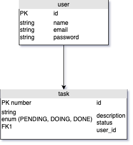

# Spring Boot To-Do List API

## Overview

The **Spring Boot To-Do List API** is a backend service built using Java and the Spring Boot framework. It provides RESTful endpoints to manage a to-do list, allowing users to create, update, delete, and retrieve tasks. This project is designed to demonstrate best practices in building APIs with Spring Boot, including features like dependency injection, data persistence, and RESTful design principles.

## Features

- **CRUD Operations**: Create, Read, Update, Delete operations for to-do items.
- **RESTful API**: Adheres to RESTful standards for endpoint structure and HTTP methods.
- **Persistence**: Uses a database for storing and retrieving to-do items.
- **Scalability**: Designed with scalability in mind to handle a growing number of tasks and users.
- **Java 100%**: Entirely built using Java with Spring Boot.

## Technologies Used

- **Java**: The core programming language.
- **Spring Boot**: Framework for building the API.
- **Spring Data JPA**: For database interaction.
- **H2 Database**: An in-memory database for development and testing.
- **Maven**: For dependency management and build automation.

## Getting Started

### Prerequisites

- Java Development Kit (JDK) 11 or higher
- Maven 3.6+ for dependency management
- An IDE like IntelliJ IDEA, Eclipse, or VS Code

### Installation

1. Clone the repository:
   ```bash
   git clone https://github.com/angelo848/spring-boot-todo-list-api.git
   cd spring-boot-todo-list-api
   ```

2. Build the Project
   ```bash
   mvn clean install
   ```

3. Run the Application
   ```bash
   mvn spring-boot:run
   ```

4. Access the API Locally At
[http://localhost:8080](http://localhost:8080)

---

## API Endpoints

| HTTP Method | Endpoint         | Description                |
|-------------|------------------|----------------------------|
| GET         | /todos           | Retrieve all to-do items   |
| GET         | /todos/{id}      | Retrieve a specific item   |
| POST        | /todos           | Create a new to-do item    |
| PUT         | /todos/{id}      | Update an existing item    |
| DELETE      | /todos/{id}      | Delete a to-do item        |

---

## Contributing

Contributions are welcome! If you wish to contribute to this project, feel free to submit a pull request or open an issue.

1. Fork the repository.
2. Create a new branch for your feature or bug fix.
3. Commit your changes and push to your fork.
4. Submit a pull request with a detailed description of your changes.

---

## UML database diagram


---

## License

This project is licensed under the MIT License. See the LICENSE file for details.
